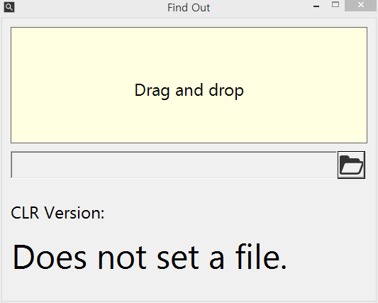

# Find Out .Net Framework CLR Version

어셈블리가 사용하는 .Net Framework CRL Version을 확인할 수 있습니다.

## Usage

### CLI

명령 프롬프트

FindOutCLRVer.exe check_file_path

```cmd
c:\>FindOutCLRVer.exe c:\someApplication.dll
```

### GUI

윈도우 탐색기에서 FindOutCLRVer.exe 실행

